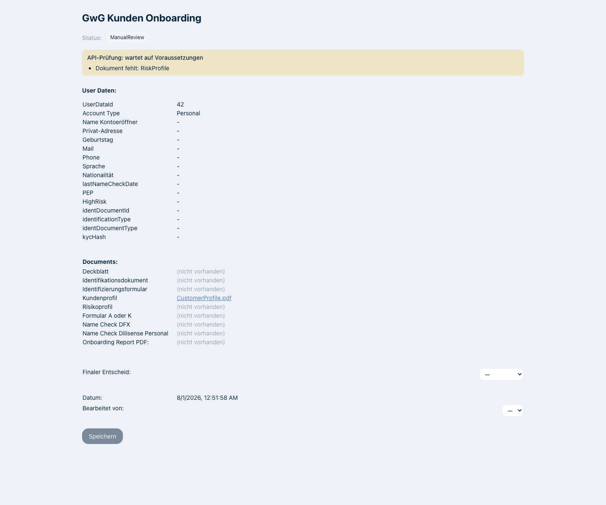

# DfxApproval für Personal-Onboardings

Personal-Freigaben werden nicht mehr als Folge einzelner Schreibzugriffe ausgeführt. Services sendet
den Entscheid über `POST /v1/support/:userDataId/dfx-approval`; die API speichert zuerst den
Onboarding-Bericht und führt anschliessend Status, UserData und Audit-Logs atomar aus.

Während ein Fall auf `ManualReview` steht, lädt die Oberfläche das serverseitige Freigabe-Gate über
`GET /v1/kyc/admin/dfx-approval/:stepId/status`. Dadurch sieht Compliance dieselben Blocker, welche
auch den neuen Minutenprozess an einer automatischen Freigabe hindern. Das Kundenprofil wird in der
Dokumentliste separat angezeigt.

Der Screenshot verwendet ausschliesslich synthetische Testdaten:

